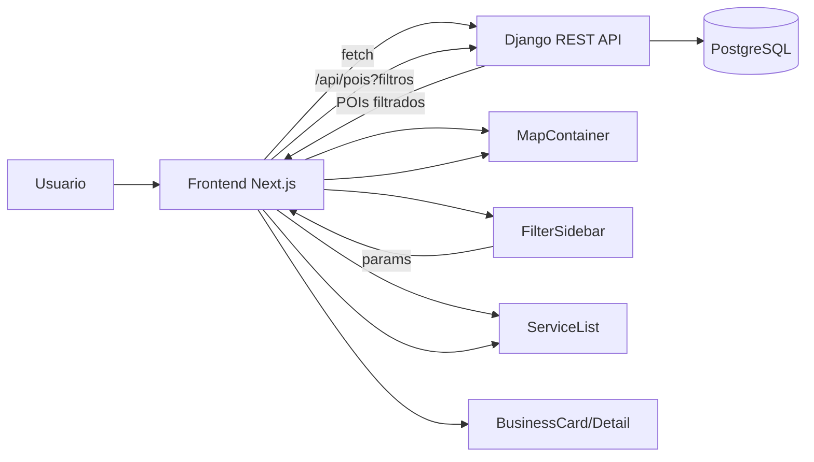

# Diagnóstico del proyecto (estado actual)

**Arquitectura:** Next.js (App Router) + TailwindCSS · Django + Django REST Framework · PostgreSQL  
**Objetivo del diagnóstico:** evaluar estructura, piezas existentes y siguientes pasos con mayor impacto.

---

## Panorama general

| Área | Estado actual | Lectura rápida |
|---|---|---|
| Backend (API) | **Robusto y listo para servir** | Modelos ricos + endpoints limpios + filtros clave ya diseñados |
| Frontend (UI) | **Base sólida, pendiente de “acabado”** | Rutas y componentes core existen, falta sistema visual y conexión dinámica completa |
| Comunidad (reviews/usuarios) | **Pendiente** | Hay una sección de reseñas, pero falta modelo/API/UX de comunidad |
| Diseño / Identidad | **Oportunidad nº1** | Tailwind sin tema propio → mayor palanca de mejora inmediata |

---

## 1) Frontend (Next.js)

### 1.1 Rutas y estructura (`src/app`)

**Ya existe**
- Home (`/`)
- Blog (`/blog`)
- Mapa (`/mapa`)
- Alta negocio (`/alta-negocio`)
- Rutas dinámicas:
  - Región: `/[region]`
  - Blog: `/blog/[slug]`
- `layout.tsx` definido (estructura global consistente)

**Conclusión**  
Arquitectura de páginas coherente y escalable para una guía/marketplace de servicios con contenido editorial.

---

### 1.2 Componentes (`src/components`)

**Organización**
- Estructura por dominios: `business`, `layout`, `map`, `poi`, `search`, `sections`.
- Buen indicador de mantenibilidad y trabajo por módulos.

**Bloques core presentes**
- Mapa: `map/MapContainer.tsx`, `map/ServiceList.tsx`
- Negocios: `business/BusinessCard.tsx`, `business/BusinessDetail.tsx`
- Búsqueda/Filtros: `search/SearchBar.tsx`, `search/FilterSidebar.tsx`
- Layout: `layout/Header.tsx`, `layout/Footer.tsx`

**Lo que se echa de menos (si se busca comunidad/engagement)**
- Autenticación (login/registro)
- Perfil de usuario
- Reseñas dinámicas (más allá de una sección estática)

**Conclusión**  
Los “ladrillos” fundamentales están. Falta convertirlos en experiencia consistente y conectada a datos.

---

### 1.3 Dependencias y estilos (`package.json`, `tailwind.config.ts`)

**Stack**
- React + Next + TailwindCSS: base moderna y adecuada.

**Observaciones**
- Componentes UI hechos “a mano” sobre Tailwind (no se aprecian librerías UI tipo Headless UI / NextUI).
- No se detectan librerías de animación (p. ej. Framer Motion): micro-interacciones pendientes.
- Tailwind sin tema extendido (paleta/tipografías/escala propia): identidad visual aún no consolidada.

**Conclusión**  
La mejora de mayor retorno es definir un **sistema de diseño** en Tailwind y aplicarlo de forma transversal.

---

## 2) Backend (Django + DRF)

### 2.1 Modelos (`api/models.py`)

**Fortalezas**
- Modelo de datos completo.
- POI especialmente detallado (incluyendo campos JSON para reglas de mascotas, contacto, etc.).
- Entidades de soporte: Region, Category, Legislation.

**Pendiente (si se quiere comunidad)**
- Modelo explícito de Review / UserProfile (o equivalente).

---

### 2.2 Vistas y lógica (`api/views.py`)

**Fortalezas**
- DRF como base: decisión correcta.
- `POIViewSet` como núcleo:
  - listado + filtrado por región/categoría/tipo
  - soporte CRUD (ModelViewSet)
- Viewsets de solo lectura para catálogos (regiones/categorías/legislación): coherente.
- `HealthView`: endpoint de salud para monitorización.

---

### 2.3 Endpoints (`api/urls.py`)

| Endpoint | Uso |
|---|---|
| `/api/health/` | health check |
| `/api/regions/` | listar/ver regiones |
| `/api/categories/` | listar/ver categorías |
| `/api/pois/` | CRUD + filtros (principal para el mapa) |
| `/api/legislations/` | información legal |

Ejemplos típicos (orientativos):
- `GET /api/pois?region=<id|slug>`
- `GET /api/pois?category=<id>`
- `GET /api/pois?type=<valor>`

---

### 2.4 Dependencias (`requirements.txt`)

**Correctas y limpias**
- Django, DRF, CORS, conector PostgreSQL (`psycopg`).

**Conclusión**  
Backend listo para sostener la experiencia principal del producto.

---

## 3) Mapa del sistema (vista rápida)

---

## 4) Diagnóstico final

**Lo esencial ya está bien construido.**  
La arquitectura está preparada para escalar, y el backend ya expone lo necesario para una experiencia rica de mapa + catálogo.

El punto actual ideal es:
- consolidar **identidad visual** (para “parecer producto”)
- conectar de forma completa la **interacción** (filtros → API → mapa/listado)
- planificar el módulo de **comunidad** (reviews/usuarios) si es objetivo del producto

---

## 5) Hoja de ruta refinada (prioridades)

### Prioridad 1 — Identidad visual (impacto máximo / esfuerzo medio)

**Objetivo**
Unificar el look & feel y profesionalizar la percepción: tipografía, colores, componentes base y estados.

**Acciones concretas**
- Extender `tailwind.config.ts`:
  - `colors` (primario/secundario/acento + neutrales + estados)
  - `fontFamily`
  - `borderRadius`, `boxShadow`, `spacing` si procede
- Crear componentes base:
  - `Button`, `Card`, `Input`, `Badge`, `SectionTitle`
- Aplicación inmediata:
  - `Header`, CTAs principales, `BusinessCard`, panel de filtros

**Definition of Done**
- Existe una paleta y tipografías definidas
- Botones y cards coherentes en toda la app
- Estados: loading/empty/error con estilo consistente

---

### Prioridad 2 — Experiencia central viva (datos en tiempo real)

**Objetivo**
Que el usuario note que el producto responde: filtra, actualiza mapa y listado sin fricción.

**Acciones concretas**
- Conectar `FilterSidebar` → construir query params
- `fetch` a `/api/pois` al cambiar filtros (con debounce)
- Actualizar:
  - marcadores en `MapContainer`
  - listado en `ServiceList`
- Añadir:
  - loading skeletons
  - empty state (“no hay resultados con estos filtros”)
  - manejo de errores (mensaje + retry)

**Definition of Done**
- Cambiar filtros actualiza resultados en mapa/lista
- Sin “saltos” visuales: loading/empty/error bien resueltos

---

### Prioridad 3 — Comunidad (reviews y perfiles)

**Objetivo**
Crear engagement: reseñas reales, perfiles, reputación de negocios.

**Acciones (backend)**
- Modelos: `Review`, `UserProfile`
- Serializers + viewsets + permisos
- Moderación básica (rate limit / flags) si aplica

**Acciones (frontend)**
- Formulario de reseña
- Listado de reseñas paginado
- Perfil simple del usuario

**Definition of Done**
- Reseñas persistentes por POI/negocio
- UI para crear y ver reseñas con validación

---

### Prioridad 4 — Pulido e innovación

**Objetivo**
Elevar de “correcto” a “excelente”: micro-interacciones, accesibilidad y rendimiento.

**Acciones**
- Animaciones y transiciones (Framer Motion u otra)
- Accesibilidad: foco, contraste, ARIA donde proceda
- Optimización: caching, SSR/ISR donde aporte valor, SEO en páginas de región y blog

---

## 6) Matriz de madurez (visual y accionable)

| Dominio | Nivel | Evidencia | Siguiente paso inmediato |
|---|---:|---|---|
| Rutas / navegación | Alto | App Router + rutas clave + dinámicas | Pulir UX y breadcrumbs en región/blog |
| Componentes core | Alto | Map/Business/Search/Layout presentes | Normalizar estilos con componentes base |
| Datos / API | Alto | DRF + filtros + health | Documentar queries y añadir paginación si falta |
| Identidad visual | Medio-bajo | Tailwind estándar | Theme Tailwind + Design tokens |
| Comunidad | Bajo | Falta modelo + endpoints | Modelos Review/UserProfile + UI de reseñas |
| Motion / micro-UX | Bajo | Sin animación | Micro-interacciones puntuales y útiles |
| Accesibilidad | Desconocido | No evaluado | Checklist WCAG básico + navegación teclado |

---

## 7) Quick wins (1–2 días)

1. Definir theme Tailwind (colores + tipografía) y aplicarlo a `Header` y CTAs.
2. Añadir estados UI consistentes: loading/empty/error para mapa y listados.
3. Conectar filtros a `/api/pois` con debounce + actualización del mapa.

---

## 8) Riesgos y mitigación

| Riesgo | Impacto | Mitigación |
|---|---|---|
| UI inconsistente al crecer | Alto | Design system + componentes base |
| Filtros sin buena UX (latencia) | Medio | Debounce + caching + skeletons |
| “Comunidad” sin moderación | Medio | Permisos, rate limit, validación y flags |
| SEO limitado por páginas dinámicas | Medio | Metadata por ruta, SSR/ISR donde aplique |

---

## 9) Próxima ejecución recomendada (orden exacto)

1. **Tema Tailwind** (paleta + tipografía + tokens)  
2. **Componentes base** (Button/Card/Input)  
3. **Conectar filtros** a `/api/pois` + estados UX  
4. **Pulido** (micro-interacciones + accesibilidad)  
5. **Comunidad** (reviews/perfiles) cuando el core esté brillante
